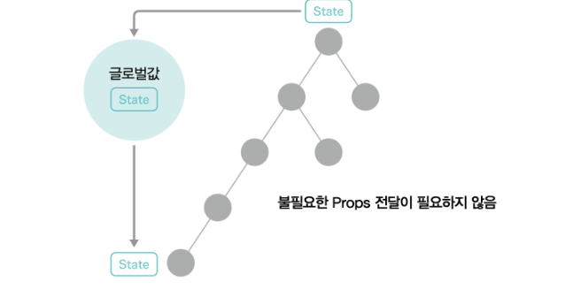

### 글로벌 State

- 글로벌 State 관리 구조를 활용하면 컴포넌트 사이에서 Props를 전달하지 않고 값을 공유할 수 있다.
- props 버킷 릴레이가 생겨버리면 재렌더링 될 필요가 없는 컴포넌트들 또한 재렌더링 되어버린다..
- 대규모 애플리케이션에서는 State와 Props 설계가 중요하다.


<출처 : [모던 자바스크립트로 배우는 리액트 입문](https://ebook-product.kyobobook.co.kr/dig/epd/ebook/E000005029039)>

### Context에서 State 관리

글로벌 State를 관리하기 위한 라이브러리가 몇 가지 있지만 리액트 자체에서 제공하는 Context 기능을 사용해본다.

1. Context 저장을 위한 React.createContext로 Context의 프로바이더를 작성한다.
2. 작성한 Context의 Provider로 글로벌 State를 다루고자 하는 컴포넌트를 감싼다.
3. State를 참조할 컴포넌트에서 React.useContext를 사용한다.

### 재렌 더링 주의

Context 객체 하나의 값이 변경될때 useContext로 Context를 참조하고 있는 컴포넌트는 모두 재렌더링된다. 따라서 하나의 Context에 속성이 다른 다양한 State를 함께 두는 것은 피해야 하며 경우에 따라 업데이트 함수를 별도의 Context로 나누는 방법도 있다.

<figcaption style="text-align:center; font-size:15px; color:#808080">Provider 작성</figcaption>

```jsx
import { createContext } from "react";

export const MyFlagContext = createContext({});

export const MyFlagProvider = (props) => {
    const { children } = props; // 무엇이든 감쌀 수 있도록 Props로 children을 받는다!
    const sampleObject = {value="test!!"};

    return (
        <MyFlagContext.Provider value={sampleObject}> {/* value에 실제 글로벌로 관리할 실젯값을 전달 */}
            {children}
        </MyFlagContext.Provider>
    );
};
```

<figcaption style="text-align:center; font-size:15px; color:#808080">참조할 컴포넌트 감싸기</figcaption>

```jsx
import ReactDOM from "react-dom";

import { App } from "./App";
import { MyFlagProvider } from "./compoents/providers/MyFlagProvider";

ReactDOM.render(
    <MyFlagProvider>
        <App />
    </MyFlagProvider>
    document.getElementById("root")
);
```

<figcaption style="text-align:center; font-size:15px; color:#808080">State 참조</figcaption>

```jsx
import { useContext } from "react";
import { MyFlagContext } from "./providers/MyFlagProvider";

export const MyFlagButton = (props) => {
  const contextValue = useContext(MyFlagContext);
  console.log(contextValue); // {value="test!!"};
  return {
    /*생략*/
  };
};
```

### Rdux

- 상태관리 라이브러리, 사실상 리액트 상태관리의 표준
- 한 방향으로만 데이터가 흐르는것이 특징
- state를 store로 관리하고 State의 업데이트는 정해진 규칙에 따라 한 방향으로 진행된다.
- 학습 비용이 높으며 번들 크기가 커지시 쉽다.
- Recoil이 정식 릴리즈되면 Redux를 채용하는 팀의 수가 줄어들 수 있을지도ㅋ

### Recoil

- 메타에서 제공하는 상태관리 라이브러리, 2020년 5월 공개, 2024년 1월 기준 아직 실험단계
- 정식 릴리즈 되지 않았으므로 큰 프로젝트보다는 작은 프로젝트나 개인개발에서 적극활용해도 좋을 단계
- 도입과 구현 장벽이 낮다. 문법 또한 리액트훅의 useState와 비슷하다.
- 1개의 큰 Store를 참조하는 Redux와 달리 여러 Store를 작성할 수 있다.
- 구조
  - Atom : 데이터 스토어
  - Slector : Atom으로부터 데이터를 얻어 변환하는 도구
