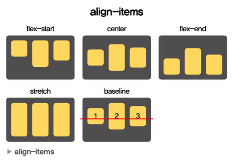
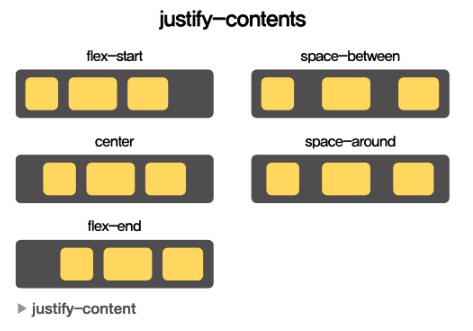

## CSS

- Cascading (계단식) Style Sheets

  ```html
  <div id="section">
    ...
    <div></div>
  </div>
  ```

  ```css
  #section {
    background-color: black;
  }

  p.medium {
    font-size: 15px;
  }

  * {
    font-size: 20px;
    color: white;
  }

  h1,
  h2,
  p {
    color: black;
    text-align: center;
  }

  button:hover {
    font-weight: bold;
  }
  a:active {
    color: red;
  }
  input:focus {
    color: #000000;
  }
  option:checked {
    background: ##00ff00;
  }
  p:first-child {
    background: #ff0000;
  }
  p:last-child {
    background: #0000ff;
  }
  ```

### Layout

- display
  ```css
  div {
    display: none | block | inline | flex;
  }
  ```
- visibility
  ```css
  div {
    visibility: visible | hidden;
  }
  ```
- position
  ```css
  div {
    position: static | fixed | relative | absolute;
  }
  ```
- etc
  ```css
  div {
    width: auto | value;
    height: auto | value;
    min-width: auto | value;
    min-height: auto | value;
    max-width: auto | value;
    max-height: auto | value;
  }
  ```

### FlexBox

```css
div {
  display: flex;
  flex-direction: row | column | row-reverse | column-reverse;
  align-items: stretch | flex-start | center | flex-end | baseline;
  justify-content: flex-start | center | flex-end | space-between | space-around;
}
```


<출처 [소플의 처음만난 리액트](https://ebook-product.kyobobook.co.kr/dig/epd/ebook/E000005511314)>

<출처 [소플의 처음만난 리액트](https://ebook-product.kyobobook.co.kr/dig/epd/ebook/E000005511314)>

### Font

```css
#title {
  font-family: "Times New Roman", Times, serif, sans-serif, monospace, cursive,
    fantasy;
  font-size: 16px; /* 16px == 1em */
  font-weight: normal | bold; /* 100 ~ 900 */
  font-style: normal | italic | oblique;
}
```

### Etc

```css
div {
  background-color: color | transparent;
  border: 1px solid black; /* border-width style color */
}
```

## [styled-components](https://styled-components.com/docs)

- template literal : 자바스크립트 문법
- backticks(`) 기호를 사용하여 문자열을 작성하고 그 안에 대체 가능한 expression을 넣는 방법
- taged template literal

  ```javascript
  const a = 1;
  const b = 2;

  function TagFunction(strings, ...numbers) {
    let str0 = strings[1];
    let str1 = strings[2];
    let str2 = strings[3];

    let a = numbers[0];
    let b = numbers[1];

    return `${a}${str0}${b}${str1}${a + b}${str2}`;
  }

  const result = TagFunction`{a} 더하기 ${b}는 ${null}입니다.`;
  console.log(result); // 1 더하기 2는 3입니다.
  ```

- styled-components 예시

  ```jsx
  import React from "react";
  import styled from "styled-components";

  const Wrapper = styled.div`
    padding: 1em;
    background: grey;
  `;

  const Title = styled.h1`
    font-size: 1.5em;
    color: white;
    text-align: center;
  `;

  export default function MainPage(props) {
    return (
      <Wrapper>
        <Title>안녕, 리액트!</Title>
      </Wrapper>
    );
  }
  ```

### styled-components의 Props 사용하기

```jsx
import React from "react";
import styled from "styled-components";

const Button = styled.button`
  color: ${(props) => (props.dark === "1" ? "white" : "black")};
  background: ${(props) => (props.dark === "1" ? "black" : "white")};
  border: 1px solid black;
`;

export default function Sample(props) {
  return (
    <div>
      <Button dark="1">Dark</Button>
      <Button dark="0">Normal</Button>
    </div>
  );
}
```

### styled-components 확장

```jsx
import React from "react";
import styled from "styled-components";

const Button = styled.button`
  background: black;
  color: white;
  border: 2px solid bold;
`;

const RoundedButton = styled(Button)`
  border-radius: 16px;
`;

export default function Sample(props) {
  return (
    <div>
      <Button>Normal</Button>
      <RoundedButton>Rounded</RoundedButton>
    </div>
  );
}
```
