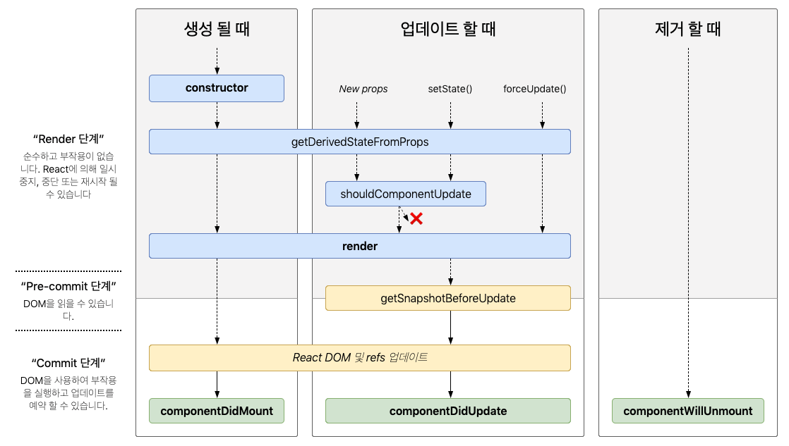

## State

- 리액트 컴포넌트의 상태
- 리액트의 컴포넌트의 변경 가능한 데이터
- 렌더링이나 데이터 흐름에 사용되는 값만 state에 포함시켜야 한다.
- state는 직접 변경이 불가능하다 ( 가능하지만 안된다. )
- state는 자바스크립트 객체이다.

  ```jsx
  class LikeButton extends React.Component {
    constructor(props) {
      super(props);
      this.state = {
        liked: false,
      };
    }
    ...
    this.setState({
        liked: true;
    })
  }
  ```

### Component Life Cycle

- Mount
  - 컴포넌트가 생성될 때
  - 마운트 이후 componentDidMount() 호출됨
- Update
  - 컴포넌트의 props가 변경될 때
  - setState()함수 호출에 의해 state가 변경될 때
  - 강제로 forceUdate() 함수가 호출될 때
  - 업데이트 이후 componentDidUpdate() 호출됨
- Unmounting
  - 상위 컴포넌트에서 현재 컴포넌트를 더 이상 화면에 표시하지 않게 될 때
  - 언마운트 이후 componentWillUnmount() 호출됨


<출처 [벨로퍼트와 함께하는 모던 리액트](https://react.vlpt.us/basic/25-lifecycle.html)>
