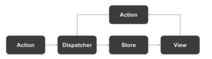

### Next.js

- 리액트 기반 모던 애플리케이션을 위한 풀 스택 프레임워크
- [버셀사](https://vercel.com)에서 오픈소스 개발을 유지 및 주도하고 있다.
- 리액트의 기능에 SSR과 SSG 등의 기능을 추가해서 구현하였다.
- 라우팅 기능을 내장하고 있고 외에도 SPA 앱을 개발하기 위한 편리한 기능들을 포함
- 다양한 기능
  - 리액트 프레임워크
  - SPA/SSR/SSG의 쉬운 전환
  - 간단한 페이지 라우팅
  - 타입스크립트 기반
  - 간단한 배포
  - 낮은 학습 비용
  - 웹팩 설정 은폐
  - 디렉터리 기반의 자동 라우팅 기능
  - 코드 분할 및 결합S
    
    <출처 [타입스크립트, 리액트, Next.js로 배우는 실전 웹 애플리케이션 개발](https://ebook-product.kyobobook.co.kr/dig/epd/ebook/E000005424419) 13p>

### Typescript

- 자바스크립트에 정적 타입기능 탑재
- 마이크로소프트가 중심이 되어 개발되고 있다.

### 대규모용 상태 관리 Flux

- 페이스북은 MVVM 프레임워크의 양방향 데이터 바인딩 기능에 대해 문제를 제기한다. 양방향 데이터 바인딩을 활용해 앱을 개발하면 코드가 간략해지는 장점이 있지만, 지나치게 사용하면 어디의 ㅂ녀경이 어디에 영향을 미치는지 추적하기 어렵고 코드의 복잡성이 높아진다는 이유였다.
- 이에 2014년 단향향으로 데이터 흐름을 한정하는 Flux 애플리케이션 아키텍처를 제안한다.
- 현대 상태 관리 라이브러리, 프레임워크는 대부분 플럭스의 사상을 어느정도 받아들였다. ( ex. Redux )
  
  <출처 [타입스크립트, 리액트, Next.js로 배우는 실전 웹 애플리케이션 개발](https://ebook-product.kyobobook.co.kr/dig/epd/ebook/E000005424419) 13p>

### AltJS

- 컴파일을 통해 자바스크립트를 생성하는 프로그래밍
- 자바스크립트가 아닌 언어로 코드를 기술하고 자바스크립트로 컴파일한느 방식의 ClosureScript, Dart 등이 있다.
- cf) 한 언어를 다른 언어로 컴파일 하는 것을 트랜스파일 이라고 부른다.

### 빌드 도구와 태스크 러너

- 빌드 시스템이란 소스 코드상에 코딩한 모듈의 의존성을 해결하고, 실행 가능한 자바스크립트 형식으로 변환하는 구조.
- 서버 사이드와 프론트엔드 양쪽의 개발에도 사용된다.
- 2015년 부터 웹팩(webpack)을 시작으로 빌드 도구의 존재감이 커짐
  - 사용하는 의존 모듈의 버전 관리와 해결을 자동화 할 수 있다.
  - 파일 결합이나 코드 압축 등을 자동화 할 수 있다.
  - 플러그인 메커니즘을 통해 다양하게 커스터마이즈 할 수 있다.
  - hot report 등 개발 효율화 도구를 포함하고 있다.

### SSR

- Node.js를 통해 서버 사이드에서 자바스크립트를 실행할 수 있는 환경이 보급되었고
- 리액트를 대표로하는 프론트엔드 컴포넌트가 가상 DOM에 의해 구현이 가능하게 됨에 따라,
- 서버 측에서 UI 컴포넌트를 렌더링해서 프런트엔드에 반환하는 구현 방법이 주목 받았습니다.
- SSR 장점
  - 렌더링을 서버 사이드에서 수행한 결과를 반환하므로, 사이트를 빠르게 표시할 수 있다.
  - 서버 사이드에서 콘텐츠를 생성하므로, SPA에서는 복잡했던 SEO를 향상할 수 있다.
- SSR 단점
  - Node.js 등 서버 사이드 자바스크립트 실행 환경이 필요하다.
    - 서버 CPU의 부담 증가
    - 서버와 클라이언트에서 자바스크립트 로직이 분산될 가능성이 있다.
