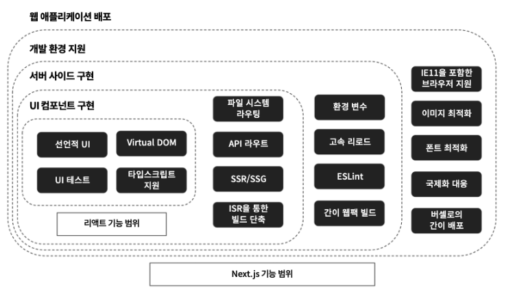

### Next.js

- 리액트 기반 모던 애플리케이션을 위한 풀 스택 프레임워크
- 라우팅 기능을 내장하고 있고 외에도 SPA 앱을 개발하기 위한 편리한 기능들을 포함
- [버셀사](https://vercel.com)에서 16년 10월 25일 공개하여 오픈소스 개발을 유지 및 주도하고 있다.
  - 2017년 4월에 빌드 효율을 높이고, 확장성을 향상시킨 Next.js 2.0을 발표
  - 2018년 9월에 에러처리를 개선하고, 리액트 콘텍스트 API를 지원하는 동적 라우팅 처리를 개선한 Next.js 7.0 발표
  - 2020년 3월에 다양한 최적화와 글로벌한 Sass및 CSS 모듈 지원된 Next.js 9.3
  - 2020년 7월에 ISR 등의 새로운 기능 추가된 9.5
  - 2021년 10월에 러스트 컴파일러 ( SWC )를 통한 빌드 고속화, 유연한 요청처리 미들웨어 구조 도입된 12.0 버전
- 리액트의 기능에 SSR과 SSG 등의 기능을 추가해서 구현하였다.
- 다양한 기능
  - 리액트 프레임워크
  - SPA/SSR/SSG의 쉬운 전환
  - 간단한 페이지 라우팅
  - 타입스크립트 기반
  - 간단한 배포
  - 낮은 학습 비용
  - 웹팩 설정 은폐
  - 디렉터리 기반의 자동 라우팅 기능
  - 코드 분할 및 결합
    
    <출처 [타입스크립트, 리액트, Next.js로 배우는 실전 웹 애플리케이션 개발](https://ebook-product.kyobobook.co.kr/dig/epd/ebook/E000005424419) 13p>

### Next.js가 필요해진 이유

- 프론트엔드 엔지니어의 업무는 리액트 컴포넌트 구현뿐 아니라 배포, 테스트, 이미지 최적화, SEO 대첵 등 많은 요소들을 학습해야만 한다.

### Typescript

- 자바스크립트에 정적 타입기능 탑재
- 마이크로소프트가 중심이 되어 개발되고 있다.

### 대규모용 상태 관리 Flux

- 페이스북은 MVVM 프레임워크의 양방향 데이터 바인딩 기능에 대해 문제를 제기한다. 양방향 데이터 바인딩을 활용해 앱을 개발하면 코드가 간략해지는 장점이 있지만, 지나치게 사용하면 어디의 변경이 어디에 영향을 미치는지 추적하기 어렵고 코드의 복잡성이 높아진다는 이유였다.
- 이에 2014년 단방향으로 데이터 흐름을 한정하는 Flux 애플리케이션 아키텍처를 제안한다.
- 현대 상태 관리 라이브러리, 프레임워크는 대부분 플럭스의 사상을 어느정도 받아들였다. ( ex. Redux )
  
  <출처 [타입스크립트, 리액트, Next.js로 배우는 실전 웹 애플리케이션 개발](https://ebook-product.kyobobook.co.kr/dig/epd/ebook/E000005424419) 13p>

### AltJS

- 컴파일을 통해 자바스크립트를 생성하는 프로그래밍
- 자바스크립트가 아닌 언어로 코드를 기술하고 자바스크립트로 컴파일하는 방식의 ClosureScript, Dart 등이 있다.
- cf) 한 언어를 다른 언어로 컴파일 하는 것을 트랜스파일 이라고 부른다.

### 빌드 도구와 태스크 러너

- 빌드 시스템이란 소스 코드상에 코딩한 모듈의 의존성을 해결하고, 실행 가능한 자바스크립트 형식으로 변환하는 구조.
- 서버 사이드와 프론트엔드 양쪽의 개발에도 사용된다.
- 2015년 부터 웹팩(webpack)을 시작으로 빌드 도구의 존재감이 커짐
  - 사용하는 의존 모듈의 버전 관리와 해결을 자동화 할 수 있다.
  - 파일 결합이나 코드 압축 등을 자동화 할 수 있다.
  - 플러그인 메커니즘을 통해 다양하게 커스터마이즈 할 수 있다.
  - hot report 등 개발 효율화 도구를 포함하고 있다.

### SSR

- Node.js를 통해 서버 사이드에서 자바스크립트를 실행할 수 있는 환경이 보급되었고
- 리액트를 대표로하는 프론트엔드 컴포넌트가 가상 DOM에 의해 구현이 가능하게 됨에 따라,
- 서버 측에서 UI 컴포넌트를 렌더링해서 프런트엔드에 반환하는 구현 방법이 주목 받았습니다.
- SSR 장점
  - 렌더링을 서버 사이드에서 수행한 결과를 반환하므로, 사이트를 빠르게 표시할 수 있다.
  - 서버 사이드에서 콘텐츠를 생성하므로, SPA에서는 복잡했던 SEO를 향상할 수 있다.
- SSR 단점
  - Node.js 등 서버 사이드 자바스크립트 실행 환경이 필요하다.
    - 서버 CPU의 부담 증가
    - 서버와 클라이언트에서 자바스크립트 로직이 분산될 가능성이 있다.

### 컴포넌트 지향

- 컴포넌트 지향으로 구현한다는 의미는, 가능한 기초적인 컴포넌트 부품을 재사용 가능한 형태로 애플리케이션의 콘텍스트에 의존하지 않는 형태로 구현하는 것을 의식하는 것
- <u>props는 단방향 데이터 흐름 구조를 갖는 것이 특징이다.</u>
- <u>state는 반드시 해당 컴포넌트 자신 및 그 하위의 컴포넌트에만 영향을 미친다.</u>
- 이 원칙을 통해 데이터를 위에서 아래 방향으로 항상 전달하는 것이 약속된다. 결과적으로 느슨한 결합을 구현할 수 있다.
- Context를 사용하면 props를 경유하지 않고도 컴포넌트 사이에 데이터를 전달 할 수 있다. ( 형제 관계 컴포넌트인 경우에도) 하지만 너무 많이 사용하면 가독성을 떨어뜨릴 수 있다.

### 아토믹 디자인과 컴포넌트 세밀도

- 팀안에 컴포넌트 세밀도에 대한 공통 인식이 없다면, 컴포넌트 수가 많아질 수록 재사용성과 코드 가독성이 떨어진다.
- 아토믹 디자인의 창시자인 브래드 프로스트는 <u>UI는 페이지 단위가 아니라 기능과 컴포넌트 단위로 구성</u>해야 한다는 개념을 공개
  
  <출처 [타입스크립트, 리액트, Next.js로 배우는 실전 웹 애플리케이션 개발](https://ebook-product.kyobobook.co.kr/dig/epd/ebook/E000005424419) 13p>

### 스토리북: 컴포넌트의 카탈로그화

- 컴포넌트를 카탈로그화해서 관리할 수 있는 개발 도구
- 컴포넌트를 누구나 확인 할 수 있는 형태로 카탈로그화 함으로써 프론트앤드와 디자이너 양쪽의 인식 차이를 줄여준다.
- 장점
  - 컴포넌트 설계를 강제할 수 있다.
  - 컴포넌트의 UI를 쉽게 확인할 수 있다.
  - 개발자 사이에서의 분업을 쉽게할 수 있다.
  - 디자이너, 엔지니어 사이에서 공통 인식을 쉽게 맞출 수 있다.
  - 컴포넌트에 전달하는 값을 동적으로 변경해서 작동을 확인할 수 있다.
  - 컴포넌트의 단위 테스트/스냅샷 테스트를 쉽게할 수 있다.
