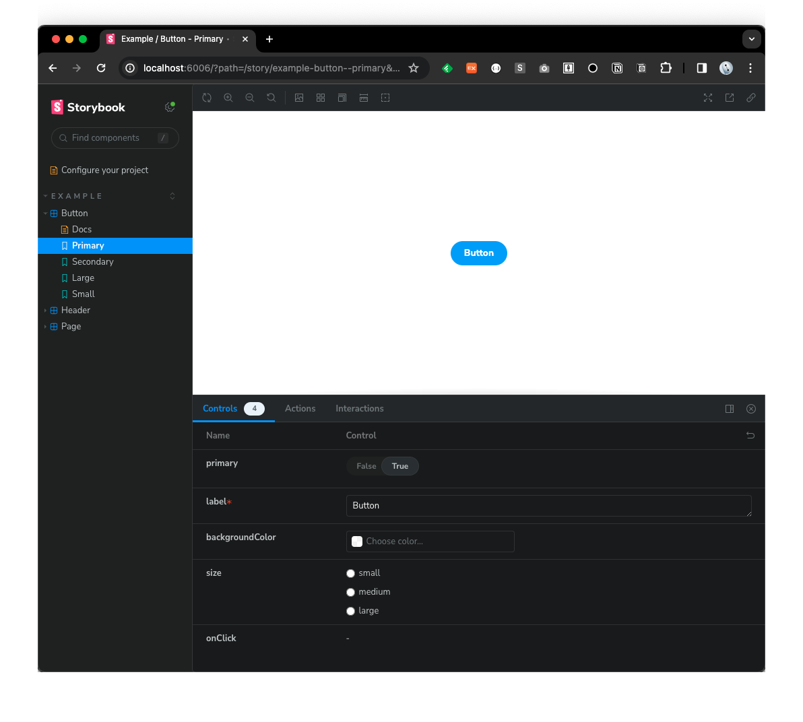

### 아토믹 디자인을 통한 컴포넌트 설계

- 프로젝트 전체에 지표가 있으면, 컴포넌트 분할의 규모나 작동에 관해 일정 수준의 합의를 기반으로 개발할 수있다.
- 이런 지표로 아토믹 디자인이 자주 사용된다.

### 프레젠테이션 컴포넌트

- 프레젠테이션 컴포넌트는 형태를 구현하는 컴포넌트이다.
- 기본적으로 props로 전달된 데이터를 기반으로 적절한 UI 부품을 표시하기만 한다.
- props만 존재하므로, 같은 props에 대해 항상 같은 것이 표시되므로 디자인에 관한 디버깅이 쉽다.

```typescript
import "./styles.css";

type ButtonProps = {
  label: string;
  text: string;
  disabled: boolean;
  onClick: React.MouseEventHandler<HTMLButtonElement>;
};

export const Button = (props: ButtonProps) => {
  const { label, text, disabled, onClick } = props;

  return (
    <div className="button-container">
      <span>{label}</span>
      <button disabled={disabled} onClick={onClick}>
        {text}
      </button>
    </div>
  );
};
```

### 컨테이너 컴포넌트

- 디자인은 구현하지 않고, 로직만 담당한다.
- Hooks를 가지며, 상태를 사용해서 내용을 전환하거나 API 호출 등의 부가 작용을 실행하는 등의 구현을 담당.
- 프레젠테이션과 컨테이너 컴포넌트로 나눔으로써 형태와 작동의 책임을 나눌 수 있어, 코드의 가독성 및 유지 보수성이 향상된다.

```typescript
import { useState, useCallback } from "react";

// 팝업을 표시하기 위한 훅
const usePopup = () => {
  const callback = useCallback((text: string) => {
    prompt(text);
  }, []);

  return callback;
};

type CountButtonProps = {
  label: string;
  maximum: number;
};

export const CountButton = (props: CountButtonProps) => {
  const { label, maximum } = props;

  const displayPopup = usePopup();

  const [count, setCount] = useState(0);

  const onClick = useCallback(() => {
    const newCount = count + 1;
    setCount(newCount);

    if (newCount >= maximum) {
      displayPopup(`You've clicked ${newCount} times`);
    }
  }, [count, maximum]);

  const disabled = count >= maximum;
  const text = disabled
    ? "Can't click any more"
    : `You've clicked ${count} times`;

  return (
    <Button disabled={disabled} onClick={onClick} label={label} text={text} />
  );
};

const MainComponent = () => {
  return (
    <div>
      <CountButton label="Click Button -> " maximum={10} />
    </div>
  );
};

export default MainComponent;
```

### 아토믹 디자인

- 본래 디자인 시스템을 구축하기 위한 방법론
- 디자인을 5계층으로 아톰, 몰리큘, 오거니즘, 템플릿, 페이지로 나눈다.
- 분류가 리액트의 컴포넌트 개발과 잘 호환된다.
- 리액트의 컴포넌트 분류에서 사용할 때는 각 계층에서 어떤 역할을 갖는지 정의해야 한다.

### 스타일드 컴포넌트

@types/styled-components 설치

```bash
$ npm install --save styled-components
$ npm install --save-dev @types/styled-components
```

next.config.js 설정 추가

```javascript
const nextConfig = {
  reactStrictMode: true,
  compiler: {
    styledComponents: true,
  },
};

module.exports = nextConfig;
```

- props를 사용해 스타일을 제어할 수 있다.

  ```typescript
  const Button = styled.button<ButtonProps>`
    color: ${(props) => props.color};
    background: ${(props) => props.backgroundColor};
    font-size: 2em;
  `;

  const Page:NextPage = () => {
    return (
      <div>
        <Button backgroundColor="#1E90FF" color="white">
      </div>
    )
  }
  ```

- CSS와 mixin이 가능하다.

  ```typescript
  import styled, { css } from "styled-components";

  const font = css`
    color: #1e90ff;
    cont-size: 2em;
  `;

  const Button = styled.button`
    background: transparent;
    margin: 1em;
    cursor: pointer;
    ${font}
  `;

  const Text = styled.p`
    font-weight: bold;
    ${font}
  `;
  ```

- 스타일 상속이 가능하다.

  ```typescript
  const Text = styled.p`
    color: blue;
    font-weight: bold;
  `;
  const BorderedText = styled(Text)`
    padding: 8px 16px;
    border: 3px solid blue;
    border-radius: 8px;
  `;
  ```

- 스타일 컴포넌트를 props.as에 원하는 요소의 이름을 넣어 다른 HTML요소로 사용할 수 있다. 아래는 p 용이었던 Text 컴포넌트를 a 용으로 상요하는 예시다.

  ```typescript
  const Text = styled.p`
    color: #1e90ff;
    font-size: 2em;
  `
  <Text as="a" href="/>
   Go to index
  </Text>
  ```

### 테마

- 테마를 사용하면 애플리케이션 전체에서 같은 스타일을 사용할 수 있어 디자인의 일관서을 얻을 수 있다.
- theme.ts 를 정의한 후 pages/\_app.tsx에 ThemeProvider에 전달하면 styled 컴포넌트에서 해당 값을 props에서 사용할 수 있다.
- pages/\_app : 커스텀 App이라 불리며, 모든 페이지에서 공통된 처리를 페이지 초기화시 추가한다. 글로벌 CSS 추가, 페이지 이동 시 레이아웃 유지 등을 위해 사용된다.

### 스토리북

- UI 컴포넌트 개발용 지원도구
- 컴포넌트 카탈로그 구축 가능
- 독립된 환경에서 UI 컴포넌트의 형태나 작동을 확인한다.
- 환경구축
  ```bash
  $ npx sb init # package.json에 구동 스크립트 자동추가
  $ npm run storybook # 기동
  ```
  
- 액션을 사용한 콜백 핸들링
- 컨트롤 탭을 사용한 props 제어
