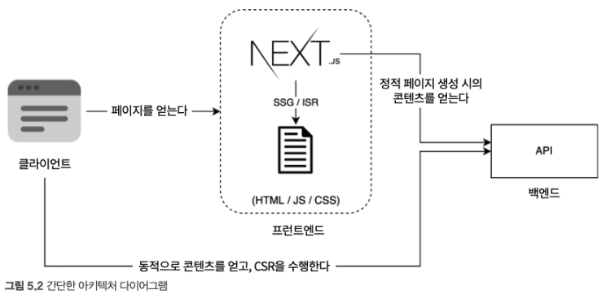
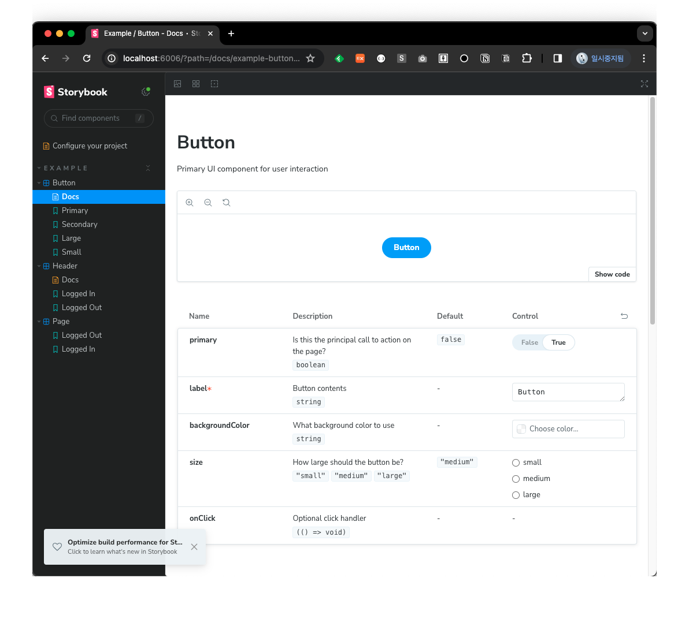

### 애플리케이션 개발

- 간단한 C2C 커머스 애플리케이션을 개발한다.
- TypeScript, ESLint/Prettier, Storybook, UnitTest
- 애플리케이션 아키텍처(CSR + ISR)
  
  <출처 [타입스크립트, 리액트, Next.js로 배우는 실전 웹 애플리케이션 개발](https://ebook-product.kyobobook.co.kr/dig/epd/ebook/E000005424419)>

### 개발환경 구축

프로젝트를 생성

> pages, styles 폴더가 생기지 않고 app 폴더가 생기는데 최신버전 Next.js에서 [App Router](https://nextjs.org/docs/app/building-your-application/routing)를 기본으로 제공하기 때문이다. [Would you like to use App Router? 질문에 No를 선택하면 pages, styles 디렉토리가 생성된다.](https://stackoverflow.com/questions/76318569/creating-a-next-js-app-in-vs-code-does-not-have-pages-or-styles-folder)

```bash
$ npx create-next-app@latest --ts
```

스파일드 컴포넌트 설정

```bash
$ npm install styled-components
$ npm install --save-dev @types/styled-components
```

next.config.js - styledComponents 활성화

```js
/** @type {import('next').NextConfig} */
const nextConfig = {
  reactStrictMode: true,
  compiler: {
    styledComponents: true,
  },
};

export default nextConfig;
```

SSR에서도 스타일드 컴포넌트가 작동하도록 pages/\_document.tsx 작성

```typescript
import Document, { DocumentContext } from "next/document";
import { ServerStyleSheet } from "styled-components";

// 기본 Document를 MyDocument로 덮어 쓴다
export default class MyDocument extends Document {
  static async getInitialProps(ctx: DocumentContext) {
    const sheet = new ServerStyleSheet();
    const originalRenderPage = ctx.renderPage;

    try {
      ctx.renderPage = () =>
        originalRenderPage({
          enhanceApp: (App) => (props) =>
            sheet.collectStyles(<App {...props} />),
        });

      // 초깃값을 유용한다
      const initialProps = await Document.getInitialProps(ctx);

      // initialProps에 더해, style을 추가해서 반환한다.
      return {
        ...initialProps,
        styles: [
          // 원래 style
          initialProps.styles,
          // styled-components의 style
          sheet.getStyleElement(),
        ],
      };
    } finally {
      sheet.seal();
    }
  }
}
```

/pages/\_app.tsx 수정하여 글로벌 스타일 적용

```typescript
import { AppProps } from "next/app";
import Head from "next/head";
import { createGlobalStyle } from "styled-components";

const GlobalStyle = createGlobalStyle`
  html,
  body,
  textarea {
    padding: 0;
    margin: 0;
    font-family: -apple-system, BlickMacSystemFont, Segoe UI, Roboto, Oxygen, Ubuntu, Cantarell, Fira Sans, Droid Sans, Helvetica Neue, sans-serif;
  }
  * {
    box-sizing: border-box;
  }

  a { 
    cursor: pointer;
    text-decoration: none;
    transition: .25s;
    color: #000;
  }

  ol, ul {
    list-style: none;
  }
`;

const MyApp = ({ Component, pageProps }: AppProps) => {
  return (
    <>
      <Head>
        <meta key="charset" name="charset" content="utf-8" />
        <meta
          key="viewport"
          name="viewport"
          content="width=device-width, initial-scale=1, shrink-to-fit-no, maximum-scale=5"
        />
        <meta property="og:locale" content="ko_KR" />
        <meta property="og:type" content="website" />
      </Head>
      <GlobalStyle />
      <Component {...pageProps} />
    </>
  );
};

export default MyApp;
```

### ESLint 설정

- typescript-eslint
- @typescript-eslint/eslint-plugin
- @typescript-eslint/parser
- eslint-plugin-prettier
- eslint-plugin-react
- eslint-plugin-react-hooks
- eslint-plugin-import
- eslint-config-prettier ✨

eslintrc.json 파일을 수정해준다.

```json
{
  "extends": [
    "next",
    "next/core-web-vitals",
    "eslint:recommended",
    "plugin:prettier/recommended",
    "plugin:react/recommended",
    "plugin:react-hooks/recommended",
    "plugin:@typescript-eslint/recommended",
    "plugin:import/recommended",
    "plugin:import/typescript"
  ],
  "rules": {
    "react/react-in-jsx-scope": "off",
    "import/order": [2, { "alphabetize": { "order": "asc" } }],
    "prettier/prettier": [
      "off",
      {
        "trailingComma": "all",
        "endOfLine": "lf",
        "semi": false,
        "singleQuote": true,
        "printWidth": 80,
        "tabWidth": 2
      }
    ]
  }
}
```

npm 명령어 추가

```json
{
  // 생략
  "scripts": {
    "dev": "next dev",
    "build": "next build",
    "start": "next start",
    "lint": "next lint --dir src",
    "format": "next lint --fix --dir src",
    "storybook": "start-storybook -p 6006",
    "build-storybook": "build-storybook",
    "test": "jest"
  }
  // 생략
}
```

lint 명령어 실행 및 format

```bash
$ npm run lint # 다수 에러 발생
$ npm run format # 포맷 수정
```

### 스토리북 설정

```bash
$ npx sb init
```

기타 플러그인 등의 라이브러리 설치

```bash
$ npm install --save-dev @storybook/addon-postcss tsconfig-paths-webpack-plugin @babel/plugin-proposal-class-properties @babel/plugin-proposal-private-methods @babel/plugin-proposal-private-property-in-object tsconfig-paths-webpack-plugin @mdx-js/react

```

스토리북 실행

```bash
$ npm run storybook
```



### 애셋 배치

스토리북 애셋을 위찬 .storybook/public 작성

```bash
$ mkdir .storybook/public
```

.storybook/main.ts 편집

```typescript
module.exports = {
  ...
  staticDirs: ['public']
}
```

### 스토리북 테마설정

[스토리북 테마설정](https://github.com/ShinHeeJin/HandsOnReact/commit/0db48a57c2d1e7e8deb54fdcf21479ca43c8c66f)

### 스토리북 설정 파일 수정
