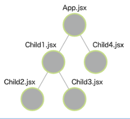

## 재렌더링이 발생하는 조건

1. State가 업데이트된 컴포넌트
2. Props가 변경된 컴포넌트
3. 재렌더링된 컴포넌트 아래의 모든 컴포넌트

## 렌더링 최적화 1 ( memo )

### 컴포넌트 메모이제이션

- 아래 구조에서 App의 state가 변경됨에 모든 컴포넌트가 재렌더링 되는데 App이외의 컴포넌트는 화면표시가 변하는 요소가 없다면 재렌더링 되지 않아도 되므로 재렌더링 되지 않도록 제어한다.
  
  <출처 : [모던 자바스크립트로 배우는 리액트 입문](https://ebook-product.kyobobook.co.kr/dig/epd/ebook/E000005029039)>

### React.memo

props에 변경이 있을 때만 재렌더링된다.
위 그림 구조에서 Child1 ~ 4를 모두 메모이제이션 해주면 App을 재렌더링 하더라고 App만 재렌더링된다.

```jsx
import {useState, memo} from "react";

export const App = memo(() = {
    // 생략
})
```

## 렌더링 최적화 2

### 함수 메모이제이션

부모 컴포넌트로부터 전달받은 콜백함수는 실행마다 함수가 다시 생성되므로 자식 컴포넌트는 해당 함수가 호출(재생성) 될때마다 재렌더링 되게된다. 이 현상을 피하기 위해서는 함수를 메모이제이션해야한다. 이렇게 자녀 컴포넌트의 Props로 전달하는 함수는 적극적으로 useCallback을 사용해 메모이제이션하여 렌더링을 최적화 한다.

```jsx
export const App = memo(() => {
  const [num, setNum] = useState(0);

  const onClickReset = useCallback(() => {
    setNum(0)
  }, []); // 의존 배열이 비어 있으므로 함수는 처음 작성된 것을 재사용하게 된다!

  return (
    <>
      <p>{num}</p>
      <Child1 onClickReset={onClickReset}>
    </>
  )
});
```
